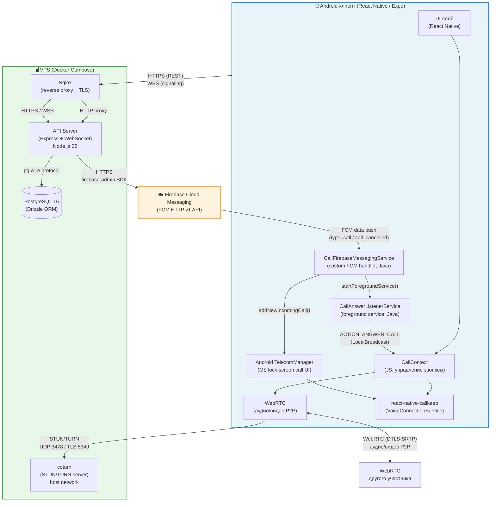
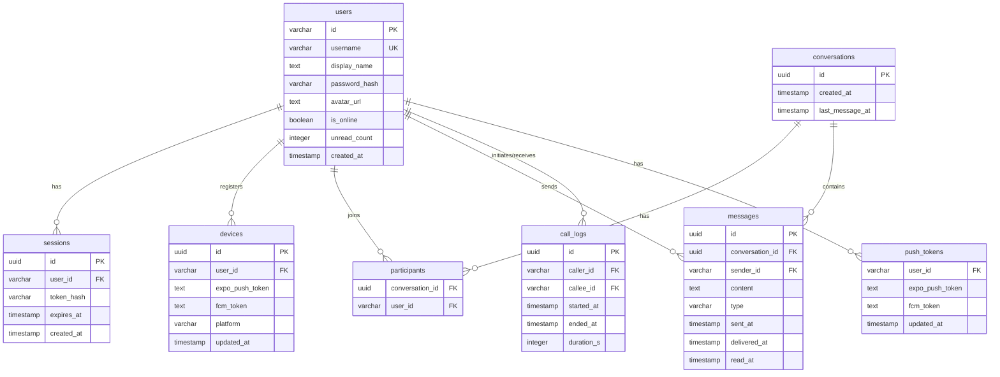
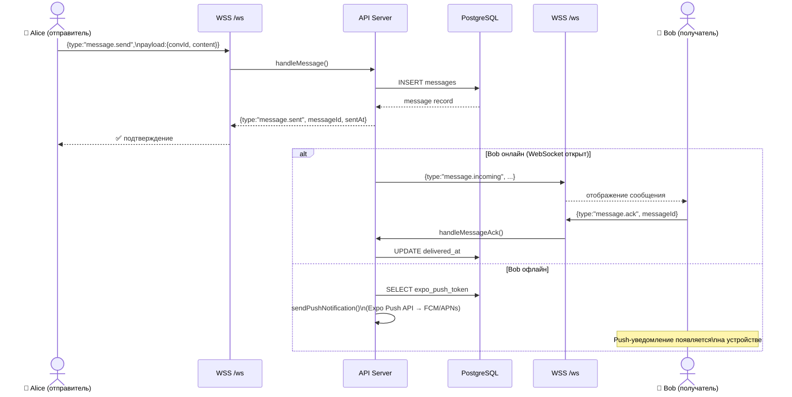
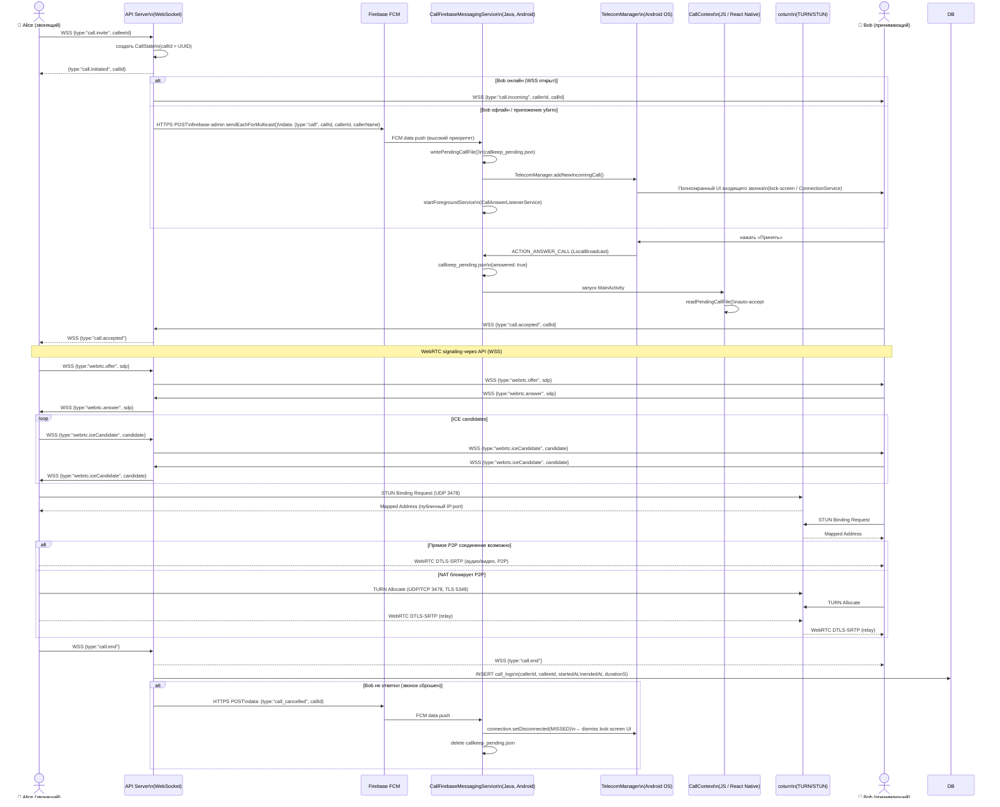
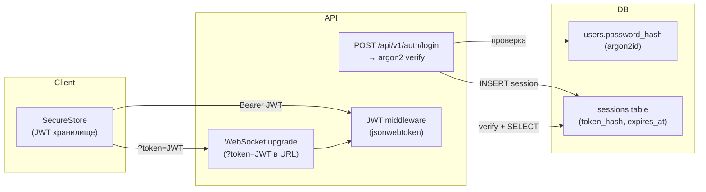

# Архитектура семейного мессенджера

## 1. Компонентная диаграмма (deployment view)

---

## 2. Схема базы данных

---

## 3. Поток текстового сообщения

---

## 4. Поток VoIP-звонка

---

## 5. Сводная таблица протоколов

| Направление | Протокол | Порт | Назначение |
|---|---|---|---|
| Client → Nginx | HTTPS | 443 | REST API (auth, messages, users, config) |
| Client → Nginx | WSS | 443 | WebSocket signaling (чат + звонки) |
| Nginx → API | HTTP | 7080 | Proxy внутри Docker-сети |
| API → PostgreSQL | pg wire | 5432 | ORM-запросы (Drizzle) |
| API → Firebase | HTTPS | 443 | firebase-admin SDK, FCM HTTP v1 |
| Firebase → Client | FCM | — | Push-уведомления, data-only call/cancel |
| Client → coturn | STUN/TURN | UDP 3478 | Обнаружение публичного адреса, relay |
| Client → coturn | TURN TLS | TCP 5349 | Зашифрованный TURN relay |
| Client ↔ Client | WebRTC (DTLS-SRTP) | ephemeral | Зашифрованный P2P аудио/видео |

## 6. Аутентификация и безопасность

> **Ключевые параметры безопасности:**
> - Пароли: **argon2id** (нативный модуль, не бандлится esbuild)
> - Токены: **JWT** (HS256), секрет из `SESSION_SECRET` / `JWT_SECRET`
> - TLS: терминация на Nginx (Let's Encrypt)
> - FCM push: прямо через firebase-admin SDK (не через Expo) для VoIP — гарантирует доставку на убитое приложение
> - WebRTC медиа: **DTLS-SRTP** (сквозное шифрование аудио/видео)
> - TURN: HMAC-SHA1 time-limited credentials (`TURN_SECRET`)
